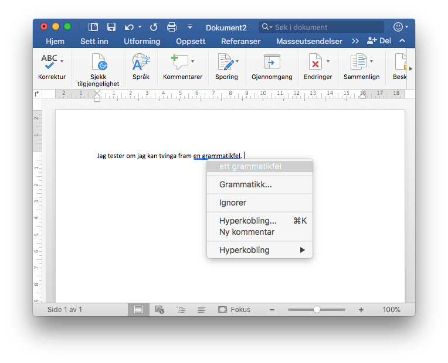
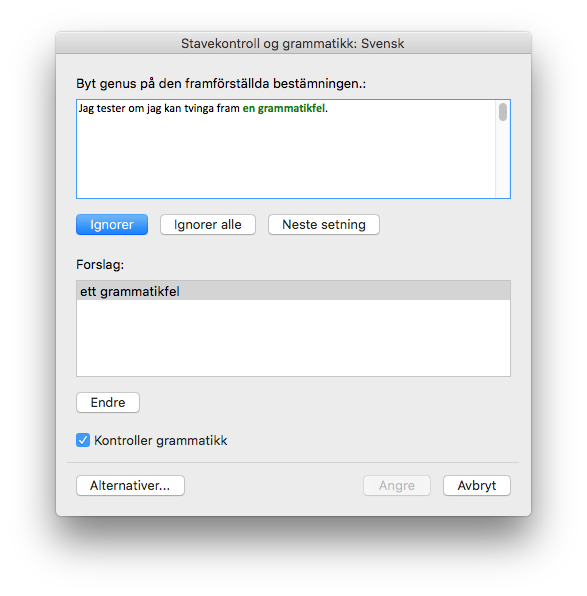
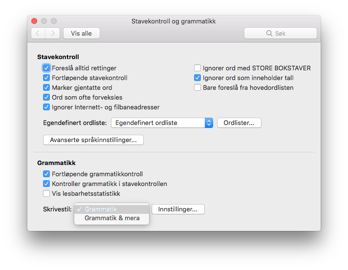
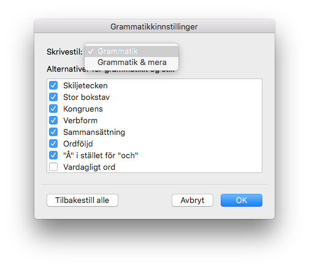
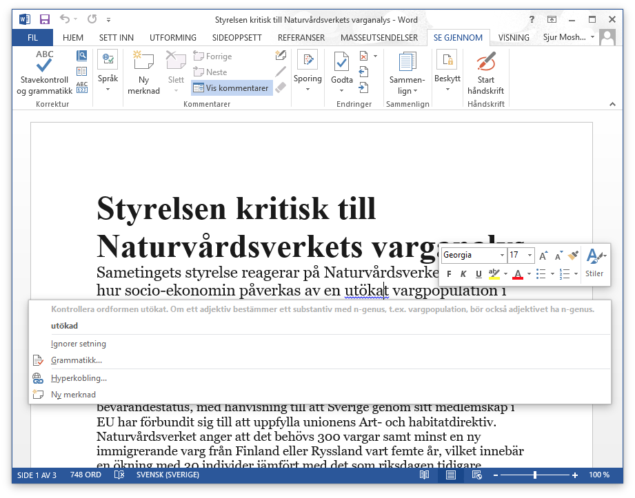
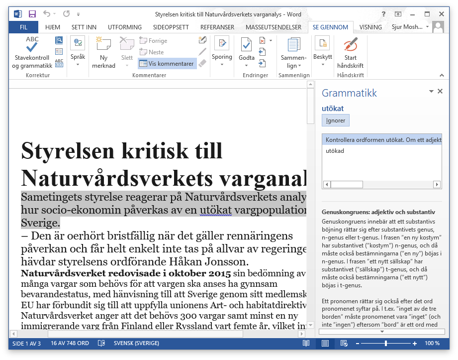
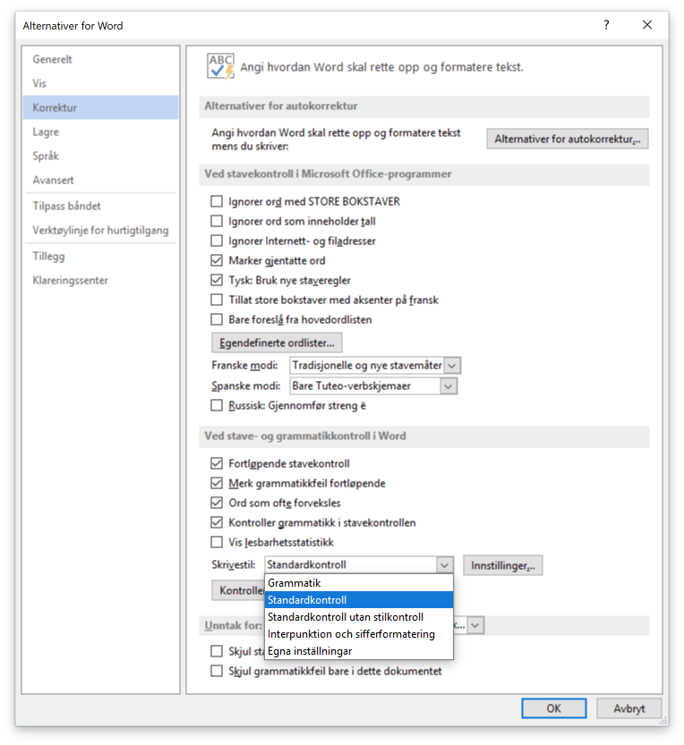
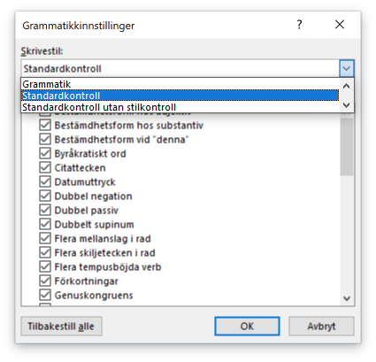

# Utsjånad

* Mest mogleg lik grammatikkontrollgrensesnittet i Word
  * høgreklikk skal gje diagnose + forslag
  * dialog skal likna på Word sin
  * men skal innehalda eit visuelt element som tydeleg viser at det er Divvun-grammatikkontrollen som står bak
* gje grøn eller blå understrekking under feil
* i kontektsmenyen (høgreklikk) skal det vera ei kort forklaring av feilen
* i dialogen skal det vera rom for ei lengre forklaring, jf korleis grammatikkontrollen fungerer i Word
* ein må klårt og tydeleg kunna sjå kva for språk teksten er skriven på (dvs det språket Word trur det er)

## Skjermbilete (mac)

Grammatikkontrollmeny:

Grammatikkontrolldialog:

Korrekturinnstillingar:  

Grammatikkonttrollinnstillingar:

## Skjermbilete (Win)

Grammatikkontrollmeny:

Grammatikkontrolldialog:

Korrekturinnstillingar:

Grammatikkonttrollinnstillingar:

## Utsjånad, oppsummering

Windows-versjonen er den klart mest oversiktlege og informative. Vi ynskjer ein grammatikkontroll for både Mac og Win som er mest mogleg lik dette.

# Funksjonalitet

## Regelsett

* det skal vera mogleg å slå av og på ulike regelsett
* regelsetta får ein frå gramcheck-biblioteket, dvs at lista med regelsett er dynamisk
* det skal vera mogleg å laga seg eigne profilar som automatisk slår på og av ulike regelsett, jf grammatikkontrollen for svensk i Word

## Office-integrering
* grammatikkontrollen må fungera i heile MS Office, alle appar der MS sin eigen grammatikkontroll fungerer
* funksjonaliteten skal vera mest mogleg lik den ein finn i MS sin eigen grammatikkontroll for svensk i Office på Windows
* på Windows skal grammatikkontrollen fylgja tastaturspråket, på same måten som Office og resten av Windows
* ein må kunna seia at vald tekst er eit visst språk
* på macOS må språket for teksten ved skrivemerket / utvalet alltid vera synleg, inklusive for språk som ikkje offisielt er støtta av MS Office
* på macOS må ein kunna definera tekstspråk til andre enn dei språka MS offisielt støttar, i prinsipp alle ISO 639-3-språk
* på macOS skal ein òg kunna flagga skrivefeil (xxx: treng vi seia dette? det kjem jo automatisk med grammatikkontrollen, spørsmålet er berre om vi krev raud strek under eller ikkje, og om vi krev raud strek - burde grammatikkontroll-API-en levera eigne funksjonar for dette?)

## Andre ting

* all kode skal sjølvsagt vera Unicode-sikker, inkl støtte for alle plan, ikkje berre BMP.

# Integrering mot `divvun-gramcheck`

All grammatikkontrollfunksjonalitet er definert av og blir levert av biblioteket [divvun-gramcheck](https://github.com/divvun/divvun-gramcheck). Dependensane til biblioteket er lista opp på github-sida, dei essensielle dependensane er repetert her:

* gcc >=5.0.0 with libstdc++-5-dev (or similarly recent version of clang, with full C++11 support)
* libhfst >=3.12.2
* libpugixml >=1.7.2
* libcg3-dev >=1.1.2.12327
* libarchive >=3.2.2-2
* hfst-ospell-dev >=0.4.5 (compiled with either libxml or tinyxml)

API-en for `divvun-gramcheck` er definert i [checker.hpp](https://github.com/divvun/divvun-gramcheck/blob/master/src/checker.hpp) / [checkertypes.hpp](https://github.com/divvun/divvun-gramcheck/blob/master/src/checkertypes.hpp). All kode er open kjeldekode, og anten C eller C++. Koden byggjer og fungerer på både Windows og macOS (og Linux).

# Front-end

The front-end code should be based on the
[GrammarSoft frontend code](https://github.com/GrammarSoft/proofing-gasmso), but reworked so that it can also run offline.

# Språklege ressursar

Dei språklege ressursane som trengst for å byggja grammatikkontrollen for nordsamisk (og alle andre språk) blir leverte av Divvun-gruppa via Giella-intrastrukturen. For nordsamisk betyr dette i praksis at Divvun leverer ei ferdig bygd fil `se.zcheck`. All språkleg funksjonalitet er inkludert i denne fila, inklusive feilmeldingar og tilbakemeldingar til brukarane.

Alle språklege ressursar er òg open kjeldekode, og det er mogleg å byggja `se.zcheck` på eiga hand. Detaljar for dette er ikkje inkludert her, sidan det ikkje er ein del av integreringsarbeidet. Dei nordsamiske ressursane er tilgjenglege [her](https://gtsvn.uit.no/langtech/trunk/langs/sme).
